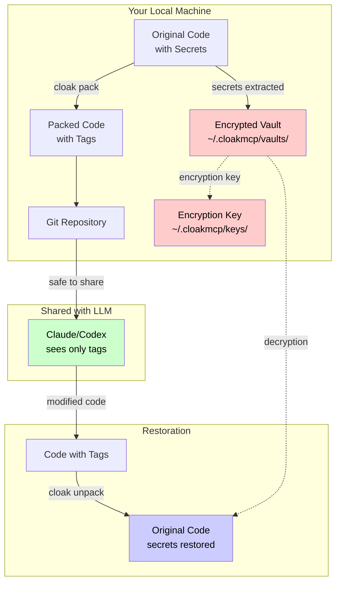
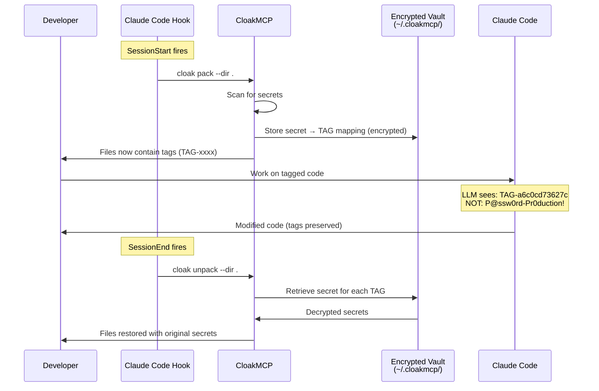
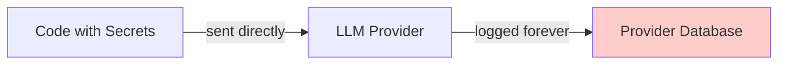
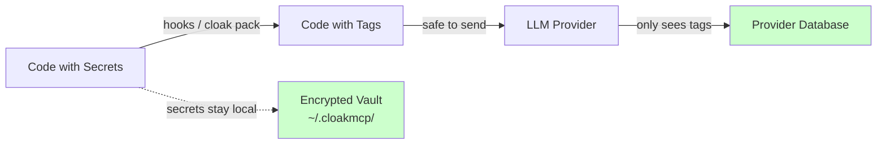
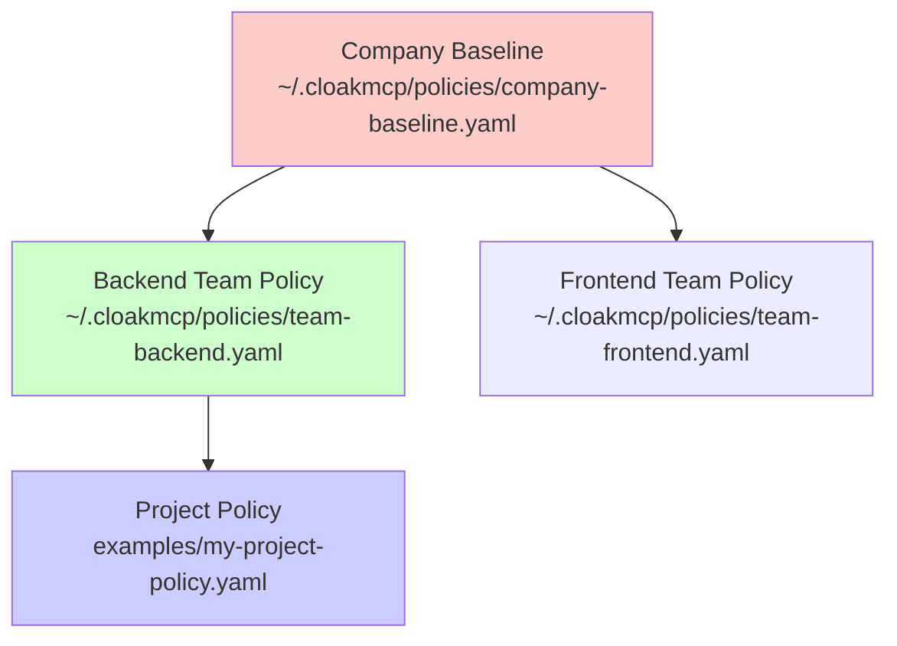

<div align="center">
<p align="center">
  <br>
</p>

# CloakMCP

### Your secrets stay home. The AI only sees tags.

**Local-first secret sanitization before LLM exposure — with automatic restoration**

[](https://opensource.org/licenses/MIT)
[](https://www.python.org/downloads/)
[](https://github.com/ovitrac/CloakMCP/releases)
[](./tests)
[](#claude-code-integration)
[](https://deepwiki.com/ovitrac/CloakMCP)
[](https://github.com/psf/black)

[See It Work](#see-it-work) • [Features](#features) • [Claude Code Integration](#claude-code-integration) • [Quick Start](#quick-start) • [Demo](#live-demo) • [Security](#security-architecture) • [Documentation](#documentation)

</div>

---

## See It Work

Every time you paste code into an LLM, your secrets go with it:

```java
private static final String API_KEY  = "sk_live_51Jd9RealKeyGoesHere";
private static final String DB_PASS  = "P@ssw0rd-Pr0duction!";
private static final String AWS_KEY  = "AKIAIOSFODNN7REALKEY1";
```

**CloakMCP intercepts — automatically, invisibly — before the LLM ever sees your code:**

```
 YOUR MACHINE                              LLM (Claude, Codex, Copilot…)
 ────────────                              ──────────────────────────────

 API_KEY = "sk_live_51Jd9RealKey"          API_KEY = "TAG-d7182d9e703d"
 DB_PASS = "P@ssw0rd-Pr0duction!"         DB_PASS = "TAG-a6c0cd73627c"
 AWS_KEY = "AKIAIOSFODNN7REALKEY1"         AWS_KEY = "TAG-f63caf98581a"
```

The LLM understands the code perfectly — it just can't see the secrets:

```
 You → Claude:   "Which variable stores the database password?"

 Claude:         "DB_PASS on line 27 stores the credential TAG-a6c0cd73627c.
                  It's used in the JDBC connection to the PostgreSQL instance."

 You → CloakMCP: cloak unpack

 Result:          TAG-a6c0cd73627c → P@ssw0rd-Pr0duction!   ← restored locally
```

**Claude identified the right variable, understood the architecture, explained the data flow — but the actual password never left your machine.** One command brings it back.

With Claude Code hooks, the entire cycle is **automatic**: secrets vanish at session start, reappear at session end. Zero human intervention.

---

## Overview

**CloakMCP** is a **local-first, deterministic sanitizer** that removes or neutralizes secrets (emails, IPs, URLs, tokens, API keys, SSH keys, JWTs) **before** your text/code reaches LLMs like Claude, GitHub Copilot, or OpenAI Codex.

### What makes CloakMCP different

| Feature | CloakMCP | ggshield / gitleaks | SOPS | DIY Scripts |
|---------|----------|---------------------|------|-------------|
| **Detect secrets** | Yes | Yes | No | Yes |
| **Reversible redaction** | Yes | No | No | No |
| **LLM-optimized workflow** | Yes | No | No | No |
| **MCP tool server** | Yes (6 tools) | No | No | No |
| **Claude Code hooks** | Yes (auto pack/unpack) | No | No | No |
| **Deterministic tags** | Yes (HMAC-based) | No | No | Varies |
| **Local-only vault** | Yes | No | No (cloud KMS) | Varies |
| **Directory pack/unpack** | Yes | No | No | No |
| **Encrypted storage** | Yes (AES-128 Fernet) | No | Yes (cloud KMS) | Varies |
| **IDE integration** | Yes (VS Code) | Yes | No | No |

### Key Capabilities

- **Local-first**: All operations run on your machine — no cloud dependencies
- **Reversible**: Deterministic tagging allows safe restoration via encrypted vaults
- **Transparent**: Claude Code hooks pack/unpack automatically at session start/end
- **MCP-native**: 6 tools exposed via Model Context Protocol for Claude Code
- **Batch processing**: Pack/unpack entire codebases with one command
- **Policy-driven**: Configure detection rules via YAML (regex, entropy, IPs, URLs)
- **Group policies**: Hierarchical policy inheritance (company → team → project)
- **Auditable**: Every operation logged to `audit/audit.jsonl`

---

## Claude Code Integration

CloakMCP integrates natively with Claude Code through **two complementary mechanisms**:

### 1. Hooks — Automatic Session Protection

When Claude Code starts a session, CloakMCP **automatically packs** all files. When it ends, it **automatically unpacks**. Zero manual steps.

```
 Claude Code starts  →  SessionStart hook  →  cloak pack   (secrets → tags)
 Claude works on code →  MCP tools available (6 tools)
 Claude Code exits   →  SessionEnd hook    →  cloak unpack (tags → secrets)
```

**Configuration** (`.claude/settings.local.json`):

```json
{
  "hooks": {
    "SessionStart": [{
      "matcher": "startup",
      "hooks": [{"type": "command", "command": ".claude/hooks/cloak-session-start.sh"}]
    }],
    "SessionEnd": [{
      "hooks": [{"type": "command", "command": ".claude/hooks/cloak-session-end.sh"}]
    }],
    "UserPromptSubmit": [{
      "hooks": [{"type": "command", "command": ".claude/hooks/cloak-prompt-guard.sh"}]
    }],
    "PreToolUse": [{
      "matcher": "Write|Edit",
      "hooks": [{"type": "command", "command": ".claude/hooks/cloak-guard-write.sh"}]
    }]
  }
}
```

The **UserPromptSubmit guard** scans every user message for secrets — blocking critical/high and warning on medium/low. The **PreToolUse guard** scans content Claude tries to write — and denies if raw secrets appear in generated code.

### 2. MCP Tool Server — 6 Tools for Claude

CloakMCP exposes tools via the **Model Context Protocol** (JSON-RPC 2.0 over stdio). Claude Code discovers them automatically:

| Tool | Description |
|------|-------------|
| `cloak_scan_text` | Scan text for secrets (returns matches without modifying) |
| `cloak_pack_text` | Replace secrets with vault tags in text |
| `cloak_unpack_text` | Restore vault tags to original secrets |
| `cloak_vault_stats` | Get vault statistics (total secrets, unique tags) |
| `cloak_pack_dir` | Pack entire directory |
| `cloak_unpack_dir` | Unpack entire directory |

**Configuration** (`.mcp.json`):

```json
{
  "mcpServers": {
    "cloakmcp": {
      "type": "stdio",
      "command": "cloak-mcp-server",
      "env": { "CLOAK_POLICY": "examples/mcp_policy.yaml" }
    }
  }
}
```

---

## Features

### Detectors

| Type | Examples | Action |
|------|----------|--------|
| AWS keys | `AKIA*`, `ASIA*` | block |
| JWT tokens | 3-part base64 | pseudonymize |
| SSH private keys | PEM blocks | replace |
| X.509 certificates | PEM blocks | block |
| Email addresses | with whitelist support | replace_with_template |
| URLs | HTTP/HTTPS (internal) | pseudonymize |
| IP addresses | IPv4/IPv6 with CIDR whitelists | pseudonymize |
| High-entropy strings | base64-like tokens | redact |
| Custom regex | user-defined patterns | configurable |

### Actions

| Action | Behavior | Reversible |
|--------|----------|------------|
| `block` | Refuse to process (exit with error) | — |
| `redact` | Replace with `<REDACTED:rule_id>` | No |
| `pseudonymize` | Replace with HMAC-based token (`TAG-xxxxxxxxxxxx`) | Yes (vault) |
| `hash` | Replace with SHA-256 hash | No |
| `replace_with_template` | Custom template (e.g., `<EMAIL:{hash8}>`) | No |
| `allow` | Keep unchanged (whitelist) | — |

### CLI Commands

| Command | Description |
|---------|-------------|
| `cloak scan --policy POL --input FILE` | Scan file, log detections (no modification) |
| `cloak sanitize --policy POL --input FILE --output OUT` | Sanitize a single file (one-shot) |
| `cloak pack --policy POL --dir DIR` | Replace secrets by deterministic tags across directory |
| `cloak unpack --dir DIR` | Restore original secrets from local vault |
| `cloak policy validate --policy POL` | Validate policy file (including inheritance chain) |
| `cloak policy show --policy POL` | Show merged policy after inheritance resolution |
| `cloak sanitize-stdin --policy POL` | Sanitize text from stdin to stdout (pipe helper) |
| `cloak verify --dir DIR` | Post-unpack verification: scan for residual tags |
| `cloak hook <event>` | Handle Claude Code hooks (session-start, session-end, guard-write, prompt-guard) |
| `cloak-mcp-server` | MCP tool server (JSON-RPC 2.0 over stdio) |

---

## Live Demo

The `demo/` directory contains a realistic Spring Boot banking microservice with 10+ fake secrets across 3 config files. Four demo scripts showcase different aspects:

### LLM Demo — The Highlight

Packs the code, asks a **real LLM** to explain it, proves the AI understands the logic without seeing secrets:

```bash
cd demo && bash llm_demo.sh              # auto-detect (Ollama / Claude)
cd demo && bash llm_demo.sh --ollama     # force local Ollama
cd demo && bash llm_demo.sh --claude     # force Claude Code CLI
```

<details>
<summary><b>Sample output — Qwen2.5-coder explains cloaked banking code</b></summary>

```
▶ Asking Ollama (qwen2.5-coder:14b) to explain the cloaked code...

  This class simulates a high-value transfer workflow in a banking service.
  It initiates the transfer by performing risk and compliance checks,
  creating a transfer intent, signing it, and calling a payment gateway.
  The process involves persisting data to a database, sending confirmation
  emails, notifying operations via a webhook, and archiving an audit trail.

The LLM understood 8 workflow steps, compliance logic, and integrations
— zero real credentials seen.
```

</details>

### MCP Protocol Demo

Shows CloakMCP as an **MCP tool server** with raw JSON-RPC protocol:

```bash
cd demo && bash mcp_demo.sh              # raw JSON-RPC protocol (5 steps)
cd demo && bash mcp_demo.sh --claude     # + full hook lifecycle with live LLM
```

With `--claude`, demonstrates the complete transparent lifecycle:
1. **SessionStart hook** fires → `cloak pack` (automatic)
2. An LLM **explains the cloaked code** — sees only TAG-xxxx tokens
3. **SessionEnd hook** fires → `cloak unpack` (automatic)

### Other Demos

```bash
cd demo && bash transcript.sh            # screenshot-friendly before/after (6 phases)
cd demo && bash run_demo.sh              # interactive 5-act presentation
```

**Full demo documentation**: See [`demo/README.md`](demo/README.md)

---

## Quick Start

### 1. Install

```bash
git clone https://github.com/ovitrac/CloakMCP.git && cd CloakMCP
python3 -m venv .venv && source .venv/bin/activate
pip install -e .
```

### 2. Setup Keys

```bash
mkdir -p keys audit
openssl rand -hex 32 > keys/mcp_hmac_key
chmod 600 keys/*
```

### 3. Pack / Unpack (Recommended Workflow)

```bash
# Pack: replace secrets with tags (vaulted, reversible)
cloak pack --policy examples/mcp_policy.yaml --dir . --prefix TAG

# Now safe to share with LLMs — secrets replaced with TAG-xxxxxxxxxxxx
# Vault stored in ~/.cloakmcp/vaults/

# Unpack: restore original secrets
cloak unpack --dir .
```

### 4. Claude Code Setup

```bash
# The repo already includes .mcp.json and .claude/hooks/
# Just start Claude Code in the project directory:
claude

# CloakMCP hooks fire automatically:
#   SessionStart → pack (secrets hidden)
#   SessionEnd   → unpack (secrets restored)
```

---

## Security Architecture

### How CloakMCP Protects Your Secrets



### Why LLMs Cannot Access Secrets



### Vault Architecture

```
~/.cloakmcp/
├── keys/
│   └── <project-slug>.key        # Fernet encryption key (AES-128, 600 perms)
└── vaults/
    └── <project-slug>.vault      # Encrypted JSON mapping {TAG → secret}
```

- **Slug**: 16-character SHA-256 prefix of project's absolute path
- **Encryption**: AES-128 via `cryptography.Fernet`
- **Permissions**: 0600 (owner read/write only)
- **Portability**: Copy `.key` and `.vault` to share between machines

### Security Properties

1. **Vault is local-only** — Never uploaded to git, cloud, or LLM
2. **HMAC-based tags** — Tags use HMAC-SHA256 with vault key; cannot reverse without vault key
3. **Brute-force resistant** — Even with tag and candidate secret, attacker needs vault key to verify
4. **Encryption protects vault** — Even if vault file leaks, attacker needs encryption key
5. **Keys are separate** — Vault + key both required for decryption

### Protection Boundaries

CloakMCP protects **files at rest**, **tool writes**, and **user prompts**.

| Boundary | Protected? | Mechanism |
|----------|-----------|-----------|
| Files on disk | Yes | `pack` at session start, `unpack` at session end |
| Write/Edit tool calls | Yes | `guard-write` hook denies high-severity secrets |
| Bash commands | Yes | `safety-guard` hook blocks dangerous commands |
| User prompts | Yes | `prompt-guard` hook blocks/warns on secrets in prompts |
| Chat after prompt | No | Prompt guard scans user input, not model responses |
| Clipboard / copy-paste | No | Use `cloak sanitize-stdin` before pasting sensitive content |

> **Tip:** Pipe text through `cloak sanitize-stdin --policy examples/mcp_policy.yaml` before pasting.
> Use vault tags (`TAG-xxxxxxxxxxxx`) when referring to credentials.
>
> **Why no output filtering?** The conversation operates entirely in tag-space by design. Rehydrating Claude's responses would create a cleartext/tag split that breaks on the next turn. See [`SECURITY.md`](SECURITY.md#dried-channel-architecture) for the full rationale.

### Data Flow Comparison

#### Without CloakMCP

**Risk**: Secrets permanently stored on provider servers

#### With CloakMCP

**Protection**: Only meaningless tags reach provider

### Common Questions

**Q: Can someone with my git repo see my secrets?**
**A**: No. Git only contains tags like `TAG-2f1a8e3c9b12`. The vault is in `~/.cloakmcp/` on your machine.

**Q: What if I lose my vault key?**
**A**: Secrets are unrecoverable. Keep backups of `~/.cloakmcp/keys/` in a secure location.

**Q: Can LLMs guess secrets from tags?**
**A**: No. Tags are HMAC-SHA256 signatures (keyed with your vault key) truncated to 12 hex chars. Without your `~/.cloakmcp/keys/`, reversing tags is cryptographically infeasible.

**Q: Does this work with any LLM / protocol?**
**A**: Yes. CloakMCP operates at the file level (pack/unpack) and at the text level (MCP tools). It works with Claude Code (native hooks + MCP), Copilot, Codex, Gemini, local Ollama models — any LLM that reads your code.

---

## Configuration

### Policy File (`mcp_policy.yaml`)

```yaml
version: 1

globals:
  default_action: redact
  audit:
    enabled: true
    path: ./audit/audit.jsonl
  pseudonymization:
    method: hmac-sha256
    secret_key_file: ./keys/mcp_hmac_key

detection:
  - id: aws_access_key
    type: regex
    pattern: '\b(AKIA|ASIA)[A-Z0-9]{16}\b'
    action: block
    severity: high

  - id: jwt_token
    type: regex
    pattern: '\b[A-Za-z0-9\-_]+\.[A-Za-z0-9\-_]+\.[A-Za-z0-9\-_]+\b'
    action: pseudonymize

  - id: email
    type: regex
    pattern: '(?i)[a-z0-9_.+-]+@[a-z0-9-]+\.[a-z0-9.-]+'
    action: replace_with_template
    template: '<EMAIL:{hash8}>'
    whitelist: ['*@example.com']

  - id: high_entropy_token
    type: entropy
    min_entropy: 4.5
    min_length: 20
    action: redact
```

### `.mcpignore` File

Controls which files are skipped during `pack`/`unpack` (similar to `.gitignore`):

```
# Binaries and build artifacts
*.pyc
*.so
dist/
build/
__pycache__/

# Virtual environments
.venv/
node_modules/

# Media
*.png
*.jpg
*.pdf

# Already sensitive
audit/
keys/
.git/
```

### Environment Variables

| Variable | Default | Description |
|----------|---------|-------------|
| `CLOAK_POLICY` | `examples/mcp_policy.yaml` | Path to the YAML policy file used by hooks |
| `CLOAK_PREFIX` | `TAG` | Tag prefix for pack operations (e.g., `TAG`, `SEC`, `KEY`) |
| `CLOAK_STRICT` | *(unset)* | Set to `1` to treat medium-severity matches as blocking (hooks escalate warn → deny/block) |
| `CLOAK_PROMPT_GUARD` | *(enabled)* | Set to `off` to disable the UserPromptSubmit hook entirely |
| `CLOAK_AUDIT_TOOLS` | *(unset)* | Set to `1` to enable Tier 2 tool metadata logging (hashed file paths) |

---

## Group Policies

**New in v0.3.2+**: Hierarchical security policies that cascade from company → team → project.



- Policies share **detection rules**, NOT vault keys
- Each project maintains its own unique vault key
- Later policies override earlier ones (same rule ID)
- Cycle detection prevents circular inheritance

```bash
# Validate policy chain
cloak policy validate --policy examples/my-project-policy.yaml

# Show merged policy after inheritance
cloak policy show --policy examples/my-project-policy.yaml --format yaml
```

**Full guide**: See [`GROUP_POLICY_IMPLEMENTATION.md`](GROUP_POLICY_IMPLEMENTATION.md)

---

## VS Code Integration

| Shortcut | Action |
|----------|--------|
| `Ctrl+Alt+S` | Sanitize current file (preview) |
| `Ctrl+Alt+A` | Scan current file (audit only) |

**Full guide**: See [`VSCODE_MANUAL.md`](VSCODE_MANUAL.md)

---

## API Server (Optional)

CloakMCP includes an optional FastAPI server for real-time sanitization:

```bash
openssl rand -hex 32 > keys/mcp_api_token
uvicorn cloakmcp.server:app --host 127.0.0.1 --port 8765
```

| Endpoint | Method | Description |
|----------|--------|-------------|
| `/health` | GET | Server status and policy hash |
| `/sanitize` | POST | Sanitize text (modify secrets) |
| `/scan` | POST | Scan text (audit only) |

All endpoints require Bearer token authentication. Server binds to `127.0.0.1` only.

---

## Testing

```bash
pip install -e ".[test]"

# Run all tests (173 passing)
pytest

# Run with coverage
pytest --cov=cloakmcp --cov-report=term
```

**Test suite**: 173+ tests across 6 test files covering unit tests, integration tests, API tests, hook tests, and MCP server tests.

---

## Project Structure

```
CloakMCP/
├── cloakmcp/                      # Main package (14 modules, ~2,150 LOC)
│   ├── __init__.py
│   ├── actions.py                 # Action engine (redact, pseudonymize, etc.)
│   ├── audit.py                   # Audit logging
│   ├── cli.py                     # CLI entry point (scan, sanitize, pack, unpack, hook)
│   ├── dirpack.py                 # Directory pack/unpack walker
│   ├── filepack.py                # Text-level pack/unpack with overlap dedup
│   ├── hooks.py                   # Claude Code hooks (session-start/end, guard-write)
│   ├── mcp_server.py              # MCP tool server (JSON-RPC 2.0 over stdio)
│   ├── normalizer.py              # Text normalization
│   ├── policy.py                  # Policy engine (YAML, inheritance, merging)
│   ├── scanner.py                 # Secret detectors (regex, entropy, IP, URL, email)
│   ├── server.py                  # FastAPI REST server (localhost)
│   ├── storage.py                 # Vault encryption (Fernet AES-128)
│   └── utils.py                   # Utilities (hashing, encoding)
├── tests/                         # Test suite (173+ tests, 6 files)
│   ├── test_comprehensive.py      # Full feature tests
│   ├── test_api.py                # API endpoint tests
│   ├── test_filepack.py           # Pack/unpack round-trip tests
│   ├── test_hooks.py              # Claude Code hook tests
│   ├── test_mcp_server.py         # MCP server protocol tests
│   └── test_smoke.py              # Basic smoke test
├── demo/                          # Live demo (Spring Boot banking service)
│   ├── llm_demo.sh                # LLM demo (Ollama / Claude)
│   ├── mcp_demo.sh                # MCP protocol + hook lifecycle demo
│   ├── transcript.sh              # Screenshot-friendly before/after
│   ├── run_demo.sh                # Interactive 5-act presentation
│   └── src/                       # Fake banking microservice (3 config files)
├── examples/                      # Example policies
│   ├── mcp_policy.yaml            # Default policy
│   └── policies/                  # Group policy examples (inheritance)
├── .claude/                       # Claude Code integration
│   ├── hooks/                     # Hook scripts (session-start/end, guard-write)
│   └── settings.local.json        # Hook + permission configuration
├── .mcp.json                      # MCP server discovery for Claude Code
├── .vscode/                       # VS Code integration
├── pyproject.toml                 # Package metadata (v0.5.0)
├── LICENSE                        # MIT License
└── README.md                      # This file
```

---

## Documentation

| Document | Description |
|----------|-------------|
| **[`README.md`](README.md)** | This file (overview and quick start) |
| **[`demo/README.md`](demo/README.md)** | Live demo guide (4 scripts, LLM + MCP) |
| **[`QUICKREF.md`](QUICKREF.md)** | One-page cheat sheet for daily use |
| **[`SERVER.md`](SERVER.md)** | Server configuration and security model |
| **[`VSCODE_MANUAL.md`](VSCODE_MANUAL.md)** | Complete VS Code integration guide |
| **[`GROUP_POLICY_IMPLEMENTATION.md`](GROUP_POLICY_IMPLEMENTATION.md)** | Group policy inheritance details |
| **[`CLAUDE.md`](CLAUDE.md)** | Project specifications (for LLMs) |
| **[`SECURITY.md`](SECURITY.md)** | Security policy and disclosure |
| **[`CONTRIBUTING.md`](CONTRIBUTING.md)** | Contribution guidelines |
| **[`tests/README.md`](tests/README.md)** | Test suite documentation |

---

## Contributing

Contributions welcome! See [`CONTRIBUTING.md`](CONTRIBUTING.md) for guidelines.

```bash
# Development setup
git clone https://github.com/ovitrac/CloakMCP.git && cd CloakMCP
python3 -m venv .venv && source .venv/bin/activate
pip install -e ".[test]"
mkdir -p keys audit && openssl rand -hex 32 > keys/mcp_hmac_key

# Code quality
black cloakmcp/ tests/
mypy cloakmcp/
bandit -r cloakmcp/
pytest -v
```

Commit convention: `type(scope): description` (e.g., `feat(hooks): add guard-write handler`)

---

## Changelog

### v0.5.0 — MCP Server + Claude Code Hooks

**Added**:
- **MCP tool server** (`cloak-mcp-server`): 6 tools via JSON-RPC 2.0 over stdio for Claude Code
- **Claude Code hooks**: SessionStart (auto-pack), SessionEnd (auto-unpack), PreToolUse (guard-write)
- **Hook handler module** (`cloakmcp/hooks.py`): session state management, stale state recovery
- **File-level pack/unpack** (`cloakmcp/filepack.py`): text-level operations with overlapping match deduplication
- **Live demo suite** (`demo/`): 4 scripts — LLM demo (Ollama/Claude), MCP protocol demo, transcript, interactive
- **Demo banking service**: Spring Boot `BankTransferService.java` with 10+ fake secrets across 3 config files
- **MCP server tests** (`tests/test_mcp_server.py`): protocol compliance tests
- **Hook tests** (`tests/test_hooks.py`): session lifecycle and guard tests

**Changed**:
- **Package renamed**: `mcp/` → `cloakmcp/` (avoids conflict with Anthropic's `mcp` package)
- **Entry points**: `cloak = cloakmcp.cli:main`, `cloak-mcp-server = cloakmcp.mcp_server:main`
- **Test suite expanded**: 90+ → 173+ tests across 6 test files

**Fixed**:
- **Overlapping match deduplication**: Prevents round-trip corruption when multiple scanner rules match overlapping text spans
- **URL regex backtracking**: Negative lookbehind prevents trailing punctuation consumption
- **Email regex catastrophic backtracking**: Bounded quantifiers replace unbounded `+`

### v0.3.3 — Performance & Test Reliability

- Fixed email regex catastrophic backtracking (10 MB: ~38s → <0.1s)
- API endpoints return proper HTTP 500 JSON responses
- Fixed test reliability issues (HMAC key path, lazy vault creation)

### v0.3.2 — Group Policy Inheritance

- Hierarchical policy loading (company → team → project)
- `cloak policy validate` and `cloak policy show` commands
- Cycle detection, deep merging, tilde expansion

### v0.3.1 — Security Hardening

- HMAC-based tags (keyed with vault key) replace plain SHA-256
- SERVER.md with threat model and security architecture

### v0.2.5 — Performance & Features

- HMAC key caching (100-1000x improvement)
- API rate limiting, vault export/import, CLI validation

### v0.2.0 — Beta Release

- Pack/unpack commands, encrypted vaults, deterministic tagging
- VS Code integration, API server, comprehensive test suite

### v0.1.0 — Alpha Release

- Initial release: scan, sanitize, policy engine, audit logging

---

## License

MIT License — see [`LICENSE`](LICENSE).

---

## Authors

**Olivier Vitrac** — *Design & Implementation* — [Adservio Innovation Lab](https://adservio.fr)

See [`AUTHORS.md`](AUTHORS.md) for the full list of contributors.

---

## Links

- **Repository**: https://github.com/ovitrac/CloakMCP
- **Issues**: https://github.com/ovitrac/CloakMCP/issues
- **Documentation**: [DeepWiki](https://deepwiki.com/ovitrac/CloakMCP)
- **License**: [MIT](./LICENSE)

---

<div align="center">

*"Claude may read, refactor, or reason on tagged data —
but never unmask what the vault keeps safe."*

**[Back to Top](#cloakmcp)**

</div>
